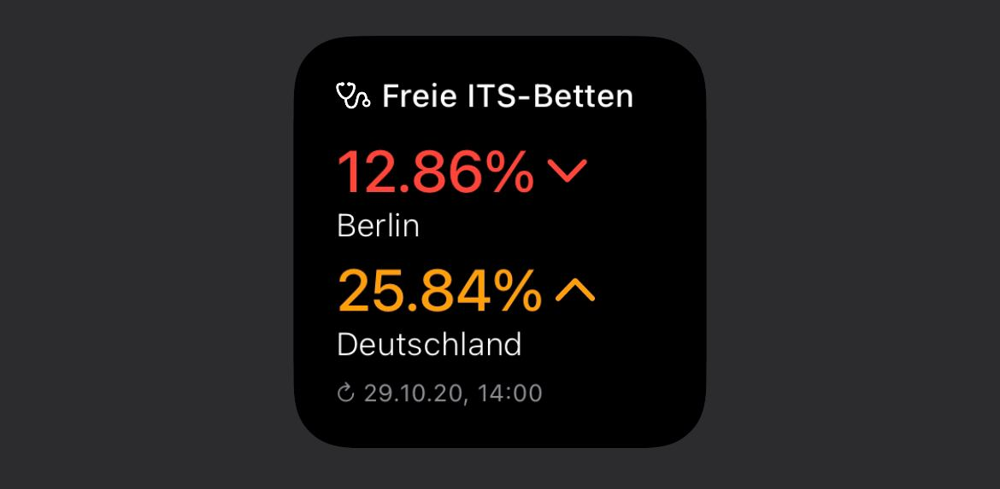

# its-beds-widget

This is a widget for [Scriptable](https://scriptable.app). To use this widget, add a new script to Scriptable, and insert this code:



```
// Licence: juliankern.com; CC BY 3.0 DE
(async () => new Function(await new Request('https://cdn.jsdelivr.net/gh/Keyes/its-beds-widget/widget.min.js').loadString())())();
```

This will load the current version, and keep it updated.
