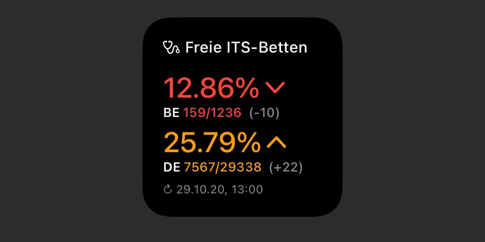

# its-beds-widget




This is a widget for [Scriptable](https://scriptable.app). To use this widget, add a new script to Scriptable, and insert this code:

```
// Licence: juliankern.com; CC BY 3.0 DE
const C = { layout: 'simple' };
(async () => new Function(await new Request('https://cdn.jsdelivr.net/gh/Keyes/its-beds-widget/widget.min.js').loadString())(C))();
```

This will load the current version, and keep it updated.

## Features
- Shows the situation of ITS beds in your current state (germany only), as well as in the whole country
- Add your state short code as parameter to change the displayed state (for short codes see below)
- Shows the timestamp of the last update - official updates happen usually once per hour 
- Multiple layouts (see config)

### Config
The following options are possible
- layout
    - 'simple': default layout (default option, see first screenshot)
    - 'extended': shows additionally absolute numbers of beds (see second screenshot)

### List of state short codes
- Baden-Württemberg: BW
- Bayern: BY
- Berlin: BE
- Brandenburg: BB
- Bremen: HB
- Hamburg: HH
- Hessen: HE
- Mecklenburg-Vorpommern: MV
- Niedersachsen: NI
- Nordrhein-Westfalen: NRW
- Rheinland-Pfalz: RP
- Saarland: SL
- Sachsen: SN
- Sachsen-Anhalt: ST
- Schleswig-Holstein: SH
- Thüringen: TH

## Development
if you want to check out the development version of this widget, you can use this code: 
```
// Licence: juliankern.com; CC BY 3.0 DE
const C = { layout: 'simple' };
(async () => new Function(await new Request('https://raw.githubusercontent.com/Keyes/its-beds-widget/dev/widget.js').loadString())(C))();
```
**Beware** Please note that this version might not always work as expected!